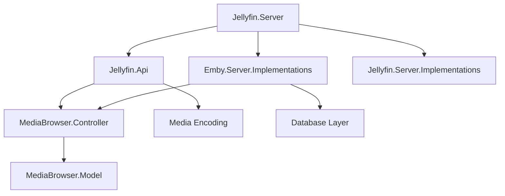

# Introduction to Jellyfin Server

Jellyfin is a Free Software Media System that puts you in control of managing and streaming your media. It is an alternative to the proprietary Emby and Plex, providing media from a dedicated server to end-user devices via multiple apps.

## What is Jellyfin?

Jellyfin is descended from Emby's 3.5.2 release and has been ported to the .NET platform to enable full cross-platform support. There are no strings attached, no premium licenses or features, and no hidden agendas—just a team that wants to build something better and work together to achieve it.

<Info>
Jellyfin is completely free and open source, licensed under GPL 2.0. You have full control over your media and your data.
</Info>

## Key Features

<CardGroup cols={2}>
  <Card title="Free & Open Source" icon="code">
    No premium licenses, no hidden costs. Jellyfin is GPL 2.0 licensed and completely free.
  </Card>
  
  <Card title="Cross-Platform" icon="window">
    Built on .NET 9.0, Jellyfin runs on Windows, Linux, macOS, and more.
  </Card>
  
  <Card title="Rich Media Library" icon="photo-film">
    Organize and stream movies, TV shows, music, photos, and live TV.
  </Card>
  
  <Card title="RESTful API" icon="code-branch">
    Comprehensive REST API with automatic OpenAPI documentation for integration and development.
  </Card>
  
  <Card title="User Management" icon="users">
    Multi-user support with granular permissions and parental controls.
  </Card>
  
  <Card title="Hardware Acceleration" icon="microchip">
    Supports transcoding with hardware acceleration via VAAPI, NVENC, QSV, and more.
  </Card>
</CardGroup>

## Architecture Overview

Jellyfin Server is built as a modern .NET application with a modular architecture:

### Core Components



- **Jellyfin.Server**: Main entry point and web host configuration
- **Jellyfin.Api**: RESTful API controllers and endpoints
- **MediaBrowser.Controller**: Core business logic and interfaces
- **Emby.Server.Implementations**: Implementation of core services
- **MediaBrowser.Model**: Data models and DTOs
- **Jellyfin.Server.Implementations**: Server-specific implementations

### Technology Stack

<CodeGroup>
```plaintext Runtime
.NET 9.0
ASP.NET Core
C# 11
```

```plaintext Database
SQLite (default)
Entity Framework Core
```

```plaintext Media Processing
FFmpeg (jellyfin-ffmpeg)
SkiaSharp (image processing)
```

```plaintext API & Docs
OpenAPI/Swagger
RESTful endpoints
JSON serialization
```
</CodeGroup>

## API Documentation

Jellyfin provides comprehensive API documentation through Swagger/OpenAPI. Once your server is running, you can access:

- **API Documentation**: `http://localhost:8096/api-docs/swagger/index.html`
- **Web Interface**: `http://localhost:8096`

<Tip>
The API is fully documented with OpenAPI specifications, making it easy to integrate Jellyfin into your own applications or build custom clients.
</Tip>

## Main API Endpoints

Jellyfin Server exposes a rich set of REST APIs organized by functional area:

### Core APIs

| Endpoint | Description |
|----------|-------------|
| `/System` | System information, configuration, and health checks |
| `/Users` | User management and authentication |
| `/Items` | Media library items and queries |
| `/Library` | Library management and scanning |
| `/Sessions` | Active sessions and playback control |

### Media APIs

| Endpoint | Description |
|----------|-------------|
| `/Videos` | Video streaming and metadata |
| `/Audio` | Audio streaming and transcoding |
| `/Images` | Image serving and manipulation |
| `/Subtitles` | Subtitle management and extraction |
| `/LiveTv` | Live TV and DVR functionality |

### Example: Get System Information

```bash
curl -X GET "http://localhost:8096/System/Info/Public" \
  -H "accept: application/json"
```

```json
{
  "LocalAddress": "http://localhost:8096",
  "ServerName": "Jellyfin Server",
  "Version": "10.9.0",
  "ProductName": "Jellyfin Server",
  "OperatingSystem": "Linux",
  "Id": "a1b2c3d4e5f6",
  "StartupWizardCompleted": true
}
```

## Use Cases

### Personal Media Server

Host your personal collection of movies, TV shows, and music. Stream to any device in your home or remotely over the internet.

### Family Entertainment Hub

Create user accounts for family members with age-appropriate content filtering and parental controls.

### Development Platform

Build custom media applications using Jellyfin's comprehensive REST API. The open-source nature allows you to extend and customize the server to your needs.

### Live TV & DVR

Integrate with TV tuners to watch and record live television, creating a complete home entertainment solution.

## Community & Support

<CardGroup cols={2}>
  <Card title="Documentation" icon="book" href="https://jellyfin.org/docs/">
    Comprehensive guides and documentation
  </Card>
  
  <Card title="Matrix Chat" icon="comments" href="https://matrix.to/#/#jellyfinorg:matrix.org">
    Join the community discussion
  </Card>
  
  <Card title="GitHub" icon="github" href="https://github.com/jellyfin/jellyfin">
    Source code and issue tracking
  </Card>
  
  <Card title="Feature Requests" icon="lightbulb" href="https://features.jellyfin.org">
    Vote on and submit feature ideas
  </Card>
</CardGroup>

## Next Steps

<CardGroup cols={2}>
  <Card title="Quickstart" icon="rocket" href="/quickstart">
    Get Jellyfin running in minutes
  </Card>
  
  <Card title="Installation" icon="download" href="/installation">
    Detailed installation instructions
  </Card>
</CardGroup>
